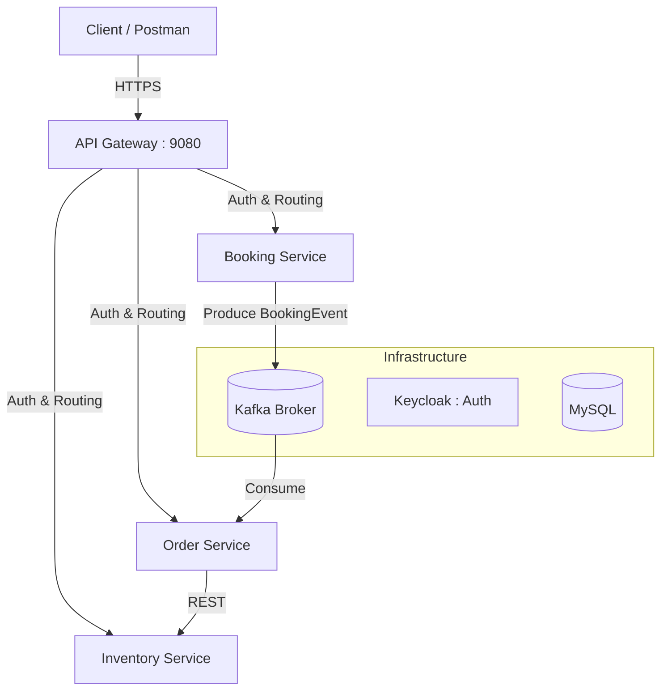

# 🎫 Ticketing System Microservices


Bienvenue dans le projet **Ticketing System**, une architecture microservices moderne conçue pour la gestion de réservations et de commandes de billets. Ce système utilise une approche orientée événements (EDA) pour garantir scalabilité et robustesse.

---

## 🏗️ Architecture du Système

Le projet est structuré autour de plusieurs microservices spécialisés communiquant via des APIs REST et des événements Kafka.



---

## 🚀 Fonctionnalités Clés

- **Architecture Microservices** : Découplage complet des responsabilités.
- **API Gateway** : Point d'entrée unique gérant le routage, la sécurité et la résilience.
- **Event-Driven Design** : Communication asynchrone entre services via **Kafka**.
- **Sécurité Centralisée** : Authentification et autorisation via **Keycloak** (OAuth2/JWT).
- **Résilience & Tolérance aux Pannes** : Implémentation de Circuit Breakers, Retries et Timeouts avec **Resilience4j**.
- **Documentation Interactive** : Documentation unifiée via **Swagger/OpenAPI**.
- **Gestion de Base de Données** : Migrations automatiques avec **Flyway**.

---

## 🛠️ Stack Technique

- **Langage** : Java 21
- **Framework Core** : Spring Boot 3.5.x & Spring Cloud 2025.x
- **Passerelle** : Spring Cloud Gateway (WebMVC)
- **Messaging** : Apache Kafka
- **Base de Données** : MySQL 8.3
- **Sécurité** : Keycloak (IAM)
- **Conteneurisation** : Docker & Docker Compose
- **Documentation** : SpringDoc OpenAPI

---

## 📦 Services du Projet

| Service | Port | Description |
| :--- | :--- | :--- |
| **`apigatewapi`** | `9080` | Gateway centrale, sécurité JWT et patterns de résilience. |
| **`BookingService`** | - | Gestion des réservations et production d'événements. |
| **`OrderService`** | - | Consommation des réservations et traitement des commandes. |
| **`common-events`** | - | Bibliothèque partagée contenant les DTOs et événements. |

---

## 🚦 Démarrage Rapide

### 1. Prérequis
- Docker & Docker Compose installés.
- JDK 21 ou supérieur.
- Maven 3.8+.

### 2. Lancement de l'Infrastructure
Utilisez Docker Compose pour démarrer MySQL, Kafka et Keycloak :
```bash
docker-compose up -d
```

### 3. Compilation & Installation
Installez le module commun en premier :
```bash
cd common-events
mvn clean install
cd ..
```

### 4. Lancement des Services
Vous pouvez lancer chaque service via Maven :
```bash
mvn spring-boot:run -pl BookingService
mvn spring-boot:run -pl OrderService
mvn spring-boot:run -pl apigatewapi
```

---

## 🔐 Sécurité & Authentification

Le projet utilise **Keycloak** pour sécuriser les points d'entrée. 
- **Realm** : `ticketing-security-realm`
- **Admin Console** : `http://localhost:9081`
- Les routes sont protégées par JWT. Pensez à configurer votre client Keycloak avant les tests.

---

## 📖 Documentation API

Une fois la Gateway démarrée, accédez à l'interface Swagger agrégée :
👉 [http://localhost:9080/swagger-ui.html](http://localhost:9080/swagger-ui.html)

Vous y trouverez les documentations de tous les services connectés.

---

## 🛡️ Résilience (Resilience4j)

La Gateway est configurée avec des seuils de tolérance :
- **Circuit Breaker** : Ouverture si 50% de fautes sur 8 requêtes.
- **Retry** : 3 tentatives automatiques en cas d'échec.
- **Time Limiter** : Timeout global de 3 secondes par appel.

---

Developed with ❤️ by [levraijmk](https://github.com/joelmk28)
